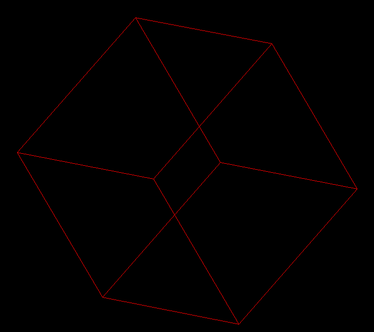
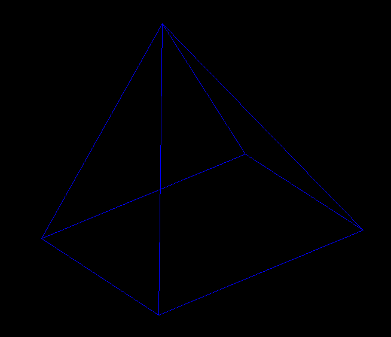

# 3DRenderer

SDL2-based wireframe demo that rotates and projects simple 3D primitives (cube, pyramid) to 2D. The window is resizable and input is mapped to simple state changes.



## Project structure

- [Makefile](Makefile)
- [README.md](README.md)
- [.gitignore](.gitignore)
- [src/](src/)
  - [src/main.cpp](src/main.cpp)
  - [2d_renderer/](src/2d_renderer/)
    - [src/2d_renderer/2d_renderer.h](src/2d_renderer/2d_renderer.h)
    - [src/2d_renderer/2d_renderer.cpp](src/2d_renderer/2d_renderer.cpp)
  - [3d_renderer/](src/3d_renderer/)
    - [src/3d_renderer/3d_renderer.h](src/3d_renderer/3d_renderer.h)
    - [src/3d_renderer/3d_renderer.cpp](src/3d_renderer/3d_renderer.cpp)
  - [app_state/](src/app_state/)
    - [src/app_state/app_state.h](src/app_state/app_state.h)
  - [input/](src/input/)
    - [src/input/input.h](src/input/input.h)
    - [src/input/input.cpp](src/input/input.cpp)

## Files and responsibilities

- Build system: [Makefile](Makefile) — targets for debug (`all`), run, release, and AddressSanitizer.
- Entry point: [src/main.cpp](src/main.cpp) — initializes `RenderState`, picks a primitive, starts the render loop.
- SDL render loop API: [src/2d_renderer/2d_renderer.h](src/2d_renderer/2d_renderer.h) — `renderer_run` declaration and frame-callback type.
- SDL render loop impl: [src/2d_renderer/2d_renderer.cpp](src/2d_renderer/2d_renderer.cpp) — creates the resizable window and VSync renderer, polls events, clears/presents, and invokes the per-frame callback.
- 3D helpers and callback API: [src/3d_renderer/3d_renderer.h](src/3d_renderer/3d_renderer.h) — rotation/project utilities, primitive builders, and the `frame_callback` signature.
- 3D helpers and callback impl: [src/3d_renderer/3d_renderer.cpp](src/3d_renderer/3d_renderer.cpp) — rotation around X/Y/Z, perspective projection, cube/pyramid generators, and the per-frame render callback.
- Shared app state and types: [src/app_state/app_state.h](src/app_state/app_state.h) — `Point3d`, `Point2d`, `Edge3d`, and `RenderState` (geometry, projection, rotation, timing, lifecycle).
- Input mapping API: [src/input/input.h](src/input/input.h) — `handleEvent` declaration.
- Input mapping impl: [src/input/input.cpp](src/input/input.cpp) — translates SDL events to state changes (quit, resize, spawn cube/pyramid, adjust angle).

## Build

Prereqs: SDL2 development headers installed and `pkg-config` available.

- Linux (bash) using [Makefile](Makefile):

```bash
make            # debug build to output/main
make run        # build and launch
make release    # optimized build
make asan       # debug with AddressSanitizer
```

If you don't use make:

```bash
mkdir -p output && g++ -std=c++17 -Wall -Wextra -g \
  $(pkg-config --cflags sdl2) -I. -Isrc \
  $(find src -name '*.cpp' -print) \
  -o output/main \
  $(pkg-config --libs sdl2)
./output/main
```

## Controls

- Esc: Quit
- c or 1: Spawn cube
- p or 2: Spawn pyramid

Rotation also animates with configured per-axis speeds in [src/main.cpp](src/main.cpp).

## Notes

- Window is resizable; resizes update the projection viewport.
- Event handling occurs once in the main loop; rendering callback is pure draw.
- Projection guards extremely small denominators to avoid infinities near the camera.
- To stop the 3d objects from rotating, just set the rotation speed for all axis to 0.
- To adjust the starting angle of the objects, change the angle X, Y and Z in main.
